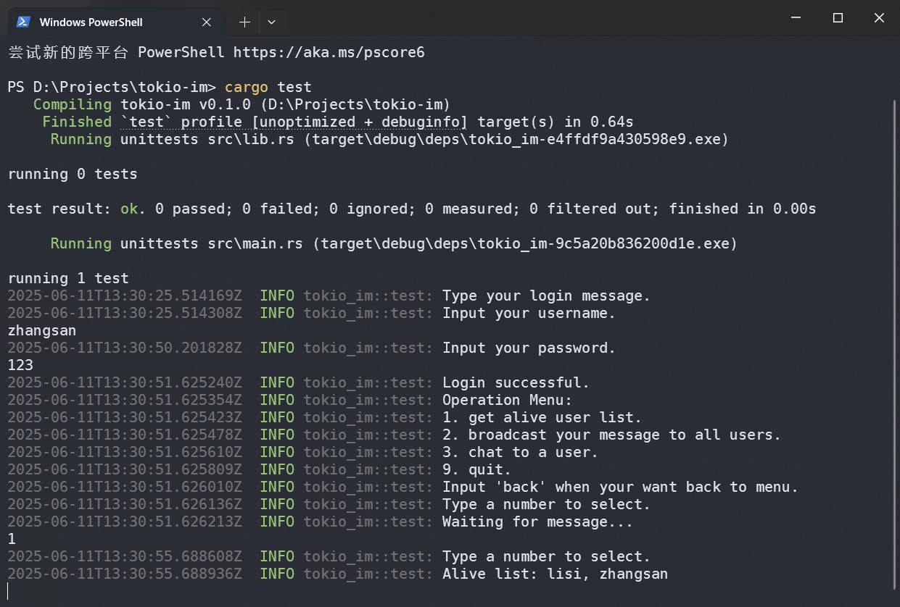

# tokio-im

基于 Tokio 网络框架的 IM（即时通讯）项目 DEMO。功能模块如下:

**1.核心通信功能**

* 登录/登出（简单的用户验证）
* 即时消息收发（自定义消息编解码器）
* 在线状态同步（在线/离线状态维护）

**2.基础扩展功能**

* 单聊/广播支持（基于消息传递异步模型）
* 多类型消息支持（支持文本/二进制格式）

## Ⅰ、技术选型

* 开发语言: Rust
* 异步与网络编程框架: Tokio

## Ⅱ、项目结构

~~~bash
tokio-im/
├── src/
│   ├── common/
│   │   ├── io_utils.rs
│   │   └── user_manager.rs
│   ├── model/
│   │   ├── message_type.rs
│   │   └── user.rs
│   ├── net/
│   │   ├── message_codec.rs
│   │   └── protobuf_codec.rs
│   ├── service/
│   │   └── user_service.rs
│   ├── lib.rs
│   ├── main.rs
│   └── test.rs
├── .env
├── build.rs
├── Cargo.toml
├── Cargo.lock
└── README.md
~~~

## Ⅲ、运行方法

1.环境准备
确保已安装 Rust 编程语言（可通过 [rustup](https://rustup.rs/) 安装），并运行以下命令：

~~~bach
cargo build
~~~

2.构建并运行服务器

在项目根目录下执行以下命令：

~~~bash
cargo run
~~~

3.运行测试一个（或多个）客户端

在项目根目录下执行以下命令：

~~~bash
cargo test
~~~

4.在客户端中输入账号密码进行登录(username: zhangsan, password: 123)

~~~bash
2025-06-11T13:30:25.514169Z  INFO tokio_im::test: Type your login message.
2025-06-11T13:30:25.514308Z  INFO tokio_im::test: Input your username.
zhangsan
2025-06-11T13:30:50.201828Z  INFO tokio_im::test: Input your password.
123
2025-06-11T13:30:51.625240Z  INFO tokio_im::test: Login successful.
2025-06-11T13:30:51.625354Z  INFO tokio_im::test: Operation Menu:
2025-06-11T13:30:51.625423Z  INFO tokio_im::test: 1. get alive user list.
2025-06-11T13:30:51.625478Z  INFO tokio_im::test: 2. broadcast your message to all users.
2025-06-11T13:30:51.625610Z  INFO tokio_im::test: 3. chat to a user.
2025-06-11T13:30:51.625809Z  INFO tokio_im::test: 9. quit.
2025-06-11T13:30:51.626010Z  INFO tokio_im::test: Input 'back' when your want back to menu.
2025-06-11T13:30:51.626136Z  INFO tokio_im::test: Type a number to select.
2025-06-11T13:30:51.626213Z  INFO tokio_im::test: Waiting for message...
1
2025-06-11T13:30:55.688608Z  INFO tokio_im::test: Type a number to select.
2025-06-11T13:30:55.688936Z  INFO tokio_im::test: Alive list: lisi, zhangsan
~~~
